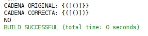
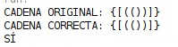
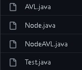
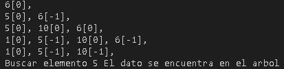

<table>
    <theader>
        <tr>
            <td></td>
            <th>
                UNIVERSIDAD NACIONAL DE SAN AGUSTIN 
                FACULTAD DE INGENIERÍA DE PRODUCCIÓN Y SERVICIOS 
                ESCUELA PROFESIONAL DE INGENIERÍA DE SISTEMAS
            </th>
            <td></td>
        </tr>
    </theader>
    <tbody>
        <tr><td colspan="3">Formato: Guía de Práctica de Laboratorio</td></tr>
        <tr><td>Aprobación:  2022/03/01</td><td>Código: GUIA-PRLD-001</td><td>Página: 1</td></tr>
    </tbody>
</table>

 <h3>INFORME DE LABORATORIO</h3>

<table>
 <theader>
  <tr><th colspan="6" bgcolor="red">INFORMACIÓN BÁSICA</th></tr>
 </theader>
 <tbody>
  <tr><td>ASIGNATUA:</td><td colspan="5">Estructura de Datos y Algoritmos</td></tr>
  <tr><td>TÍTULO DE LA PRACTICA:</td><td colspan="4">Árboles<td></tr>
  <tr><td>NÚMERO DE PRÁCTICA:</td><td>Practica de Laboratorio 05</td><td>AÑO LECTIVO:</td><td>2022 A</td><td>NRO. SEMESTRE:</td><td>III</td></tr>
  <tr><td>FECHA DE PRESENTACIÓN:</td><td>12-Jun-2022</td><td>HORA DE PRESENTACIÓN:</td><td colspan="3">11:30 p.m.</td></tr>
  <tr><td>INTEGRANTES:</td><td colspan="3">-Diego Ivan Pacori Anccasi -Edson Joel López Quispe -Oliver Alessandro Mayta Nolasco -Edwin Francisco Aguilar Tancayo -Jordy Emanuel Ayma Cutipa</td><td>NOTA:</td><td>...</td></tr>
  <tr><td>DOCENTE:</td><td colspan="5">Richart Smith Escobedo Quispe - rescobedoq@unsa.edu.pe</td></tr>
 </tbody>
</table>
<table>
 <theader>
  <tr><th>SOLUCIÓN Y RESULTADOS</th></tr>
 </theader>
 <tbody>
  <tr><td><strong>I. SOLUCIÓN DE EJERCICIOS/PROBLEMAS:</strong> 
  <ul>
    <ol>
        <li>Corchete equilibrados</li>
	    -El programa se encarga de equilibrarlos corchetes  Se considera que dos corchetes son un par coincidente si un corchete de apertura (es decir, (, [, o ) aparece a la izquierda de un corchete de cierre (es decir, ), ] o ) del mismo tipo exacto. Hay tres tipos de pares de corchetes coincidentes: [], {} y ()   
        
        
        <li>Operaciones de árbol AVL</li>
	    -Se simula las operaciones de un AVL  
        <li>Árbol AVL</li>
	    -Los AVL se parecen mucho a los BST , pero destacan porque presentan un factor de equilibrio, la cual no debe superar en 2 niveles la raiz izquierda a la derecha y viceversa garantizando mejores tiempos de ejecución. Para el ejecicio se crearon tres clases: 
         En la clase AVL contiene el código del funcionamiento, inserción busqueda, eliminación y un metodos para imprimer el arbol en post orden, el, la clase Node contiene la forma basica de un Nodo visto en anteriores  laboratorios, la clase NodeAVL es una extención de la clase Node referido al AVL, y la clase Test son experimentos de la funcionalidad. 
         Al lado de Valor esta el factor de equilibrio 
    </ol>
  </ul>

  <tr><td><strong>III. CONCLUSIONES:</strong> - Un AVL es un arbol binario de busqueda que satisface la condicion de estar balanceado 
  - La propiedad del balanceo dice que para cada nodo la diferencia de alturas entre el subarbol izquierdo y derecho es a lo sumo 1 
  - Esta propiedad garantiza que la altura del arbol sea de O(log n) 
  - En cada nodo del arbol se guarda informacion de la altura </td></tr>
 </tbody>
</table>

<table>
 <theader>
  <tr><td><strong>III. RETROALIMENTACIÓN GENERAL</strong> 
  </td><tr>
 </theader>
 <tbody>
  <tr><td>- AVL (Addelson-Velskii y Landis) Este tipo de arbol nos permite tener una estructura eficiente con respecto a su padre el BST, y trata de mantenerlo balanceado(BST)
  </td></tr>
 </tbody>
</table>

<table>
 <theader>
  <tr><td><strong>REFERENCIAS Y BIBLIOGRAFÍA</strong></td><tr>
 </theader>
 <tbody>
  <tr><td>https://algorithmtutor.com/Data-Structures/Tree/AVL-Trees/</td></tr>
  <tr><td>https://docs.oracle.com/javase/tutorial/java/generics/types.html</td></tr>
  <tr><td>...</td></tr>
  <tr><td>...</td></tr>
  <tr><td>...</td></tr>
 </tbody>
</table>
